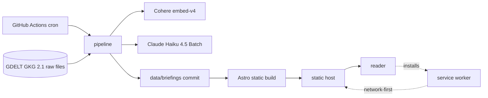
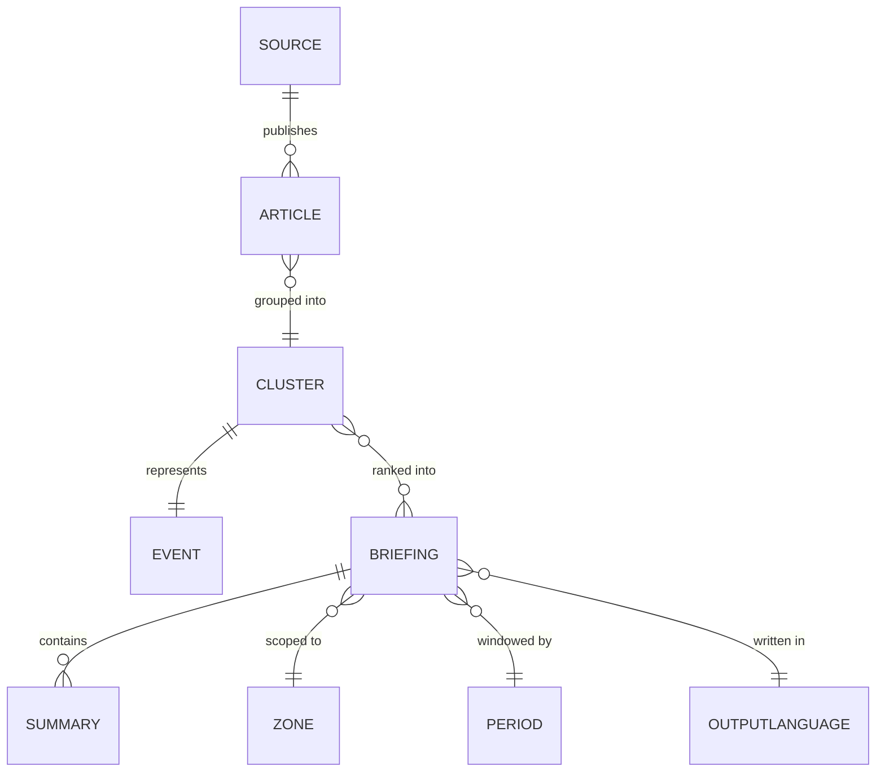

# Architecture Spine — 5 News

## Design Paradigm

**Pipes-and-filters for generation; static publication for reading.** Two halves that share nothing but a directory of files.

The batch is a linear chain of filters, each transforming a stream and each runnable and inspectable alone. This is not stylistic: the Build Order requires standing up ingestion and deduplication, looking at real output for days, and only then continuing. A stage that cannot run without its successors would make that impossible.

The read path is a static site. It performs no computation, holds no connection to the pipeline, and cannot call anything the pipeline calls. The two halves meet at one place: generated Briefing files committed to the repository.

```
collect ─→ deduplicate ─→ cluster ─→ rank ─→ summarize ─→ publish
   │            │            │         │          │           │
 Article    Article      Cluster   Briefing   Briefing    JSON files
 stream    stream(-)                          (+text)    in repo
                                                              │
                                              ┌───────────────┘
                                              ▼
                                    static build ─→ CDN ─→ reader
```

| Layer | Directory | May depend on |
| --- | --- | --- |
| Pipeline stages | `pipeline/stages/` | `pipeline/domain/`, its own inputs |
| Pipeline domain types | `pipeline/domain/` | nothing |
| External adapters | `pipeline/adapters/` | `pipeline/domain/` |
| Generated data | `data/briefings/` | nothing (inert files) |
| Site | `site/` | `data/briefings/` only |

## Invariants & Rules

### AD-1 — The read path performs no computation

- **Binds:** all of `site/`, FR-1, NFR-1, NFR-2
- **Prevents:** a reader request that costs money or time proportional to demand; the ~8-second wait that the product exists to avoid
- **Rule:** No code under `site/` may call an AI, embedding, ingestion, or third-party API, at build time or request time. The site reads `data/briefings/*.json` and renders. Any new capability that needs computation is a pipeline stage that writes a file, never a call from the site.

### AD-2 — The pipeline writes files; the site reads them. Nothing else crosses.

- **Binds:** `pipeline/` ↔ `site/`, FR-15
- **Prevents:** the two halves coupling through a database, a queue, or a shared runtime — which would let a pipeline failure take the site down, and would put pipeline latency in the reader's path
- **Rule:** The only interface between pipeline and site is the JSON files under `data/briefings/`. The site imports no pipeline module; the pipeline imports no site module. Either half must be replaceable without touching the other.

### AD-3 — Every stage is independently runnable and inspectable

- **Binds:** all of `pipeline/stages/`, PRD §10 Build Order
- **Prevents:** a pipeline that can only be observed end-to-end, which would make the Build Order's inspection window impossible and defer discovery of ranking problems until after the UI exists
- **Rule:** Each stage reads its input from disk and writes its output to disk under `data/intermediate/<stage>/`. A stage is invocable alone against a saved input. Stages communicate through those files, never through in-memory handoff or a shared mutable object.

### AD-4 — Ranking is deterministic and AI-free

- **Binds:** `pipeline/stages/rank/`, FR-6, FR-9
- **Prevents:** the product's central judgment acquiring a hallucination surface; a ranking that cannot be re-derived or defended
- **Rule:** The rank stage takes Qualifying Clusters and emits an ordered list using only integer counts. No model call, no randomness, no wall-clock read, no map-iteration-order dependence. Re-running the stage on identical input produces byte-identical output. Ordering: Independent Source count descending, then country count descending, then a stable tiebreak on cluster identity.

### AD-5 — Independent Source counting happens before ranking, never after

- **Binds:** `pipeline/stages/dedupe/`, `pipeline/stages/rank/`, FR-9, FR-7
- **Prevents:** wire copy inflating both the ranking and the number displayed as proof — the failure that breaks the mechanism and the trust artifact at the same time
- **Rule:** The deduplicate stage is the only place that decides what counts as an Independent Source, and it runs before clustering. Downstream stages consume its verdict and never recount. The count written into a Briefing is the count that ranking used — one number, computed once.

### AD-6 — The AI stage receives selected Clusters and returns text

- **Binds:** `pipeline/stages/summarize/`, FR-11, FR-13, FR-14
- **Prevents:** model output leaking into selection, ordering, or counts through a "while you're there" prompt addition
- **Rule:** The summarize stage's input is a Briefing that is already ordered and counted. Its output is generated text keyed to Cluster identity — the Summary, and since Story 6.1 the Headline, both returned by the same constrained call. It may not add, remove, reorder, or renumber anything. A summarize failure for one Cluster degrades that item to its Article title and outbound link; it never fails the Briefing.
- **Note on the Headline (Story 6.1):** adding a second generated field to the same prompt is exactly the shape this AD's "while you're there" clause warns about, so the distinction is worth stating. What that clause forbids is model output reaching *selection, ordering, or counts* — the things ranking decides. A Headline is neither: it is display text for a Cluster already selected and already counted, produced by the same call, under the same corroboration rule (FR-13), and degrading by the same path. The boundary AD-6 draws is intact; the stage's text output simply has two fields instead of one.

### AD-7 — A published Briefing is immutable; regeneration writes a new one

- **Binds:** `data/briefings/`, `pipeline/stages/publish/`, FR-19, NFR-3
- **Prevents:** a partially-written Briefing being served; a failed cycle destroying the last good output
- **Rule:** The publish stage writes a complete Briefing set or writes nothing. Publication is atomic at the set level: a cycle that fails mid-generation leaves the previous set in place, untouched. Every Briefing carries the generation timestamp of the cycle that produced it.

### AD-8 — Service worker: network-first for Briefings, cache-first for assets

- **Binds:** `site/public/sw.js`, FR-19, FR-21, NFR-1, NFR-6
- **Prevents:** a returning reader seeing yesterday's news from cache — silent, invisible to them, and the worst failure this product can produce
- **Rule:** Briefing HTML and JSON use network-first with a 2–3 second timeout and cache as fallback only. Hashed assets use cache-first. Stale-while-revalidate is forbidden on Briefing content: it would guarantee that the first paint on open is the previous day's. The offline cache is a safety net, never the default source.

### AD-9 — Each cycle produces a byte-different service worker

- **Binds:** `site/public/sw.js`, `pipeline/stages/publish/`, FR-21
- **Prevents:** a stale service worker surviving a deploy and continuing to serve an old cache generation
- **Rule:** The cycle's build identifier is stamped into the service worker source, so every publication changes its bytes. The worker deletes caches whose name does not carry the current identifier, and uses `skipWaiting` + `clients.claim` so an update lands on the visit that discovers it rather than the next one.

### AD-10 — Upstream failure degrades coverage, never the cycle

- **Binds:** `pipeline/adapters/`, `pipeline/stages/collect/`, NFR-3
- **Prevents:** one rate-limited API taking down a whole generation cycle, and the resulting empty page
- **Rule:** Every external adapter returns partial results plus a record of what failed. The collect stage proceeds with what it has and writes the failure record into the cycle's metadata. Only a total ingestion failure aborts the cycle — and aborting means leaving the previous Briefing set in place (AD-7), never publishing an empty one.

### AD-11 — A cycle is resumable; the batch submission is not awaited in-process

- **Binds:** `.github/workflows/generate.yml`, `pipeline/stages/summarize/`, `pipeline/stages/publish/`, AD-6, AD-7
- **Prevents:** the collision between an asynchronous Batch API (most batches finish within an hour, but the contractual maximum is 24) and a scheduled job that must exit — where a job that waits can hang for hours and a job that exits never publishes
- **Rule:** A cycle runs in two phases with durable state between them. Phase one runs collect through summarize-submit and writes the batch identifier into the cycle's metadata; the job then exits. Phase two polls for that batch, and on completion runs summarize-collect and publish. Neither phase holds a process open waiting on an external service. A cycle whose batch has not completed leaves the previous Briefing set in place (AD-7) and is retried by the next scheduled run, which finds the pending batch identifier and resumes rather than starting over.

### AD-12 — One stage owns each written field; downstream stages copy, never recompute

- **Binds:** all of `pipeline/stages/`, AD-4, AD-5
- **Prevents:** two stages each computing the same value from their own view of the data and disagreeing — most dangerously the Independent Source count, which is simultaneously the ranking input and the number displayed as proof
- **Rule:** Every field in the published schema has exactly one producing stage. `dedupe` owns Independent Source and country counts; `cluster` owns Cluster membership and identity; `rank` owns ordering and inclusion; `summarize` owns generated text only -- the Summary and, since Story 6.1, the Headline; `publish` owns the generation timestamp and cycle identifier. A stage that needs a value it does not own reads it from its input and passes it through unchanged. Recomputing a value another stage owns is a defect even when the result happens to match.

### AD-13 — External services are reached only through adapters

- **Binds:** `pipeline/adapters/`, NFR-5
- **Prevents:** GDELT's query ceilings, Cohere's client, and the Claude SDK leaking their shapes into stage logic — which would make swapping any of them a pipeline-wide edit
- **Rule:** Stages depend on adapter interfaces expressed in domain terms, never on a vendor SDK type. Rate limiting, retry, pagination, and batching live inside the adapter. Acquisition is via public APIs and published feeds only; no scraping.

## Consistency Conventions

| Concern | Convention |
| --- | --- |
| Domain vocabulary | The PRD Glossary is binding in code: `Article`, `Source`, `IndependentSource`, `WireCopy`, `Cluster`, `QualifyingCluster`, `ConsensusScore`, `Zone`, `Period`, `Briefing`, `Summary`, `Headline`, `OutputLanguage`, `DiscardedVolume`. No synonyms in type names, file names, or JSON keys. |
| Stage naming | One directory per stage under `pipeline/stages/`, named for the verb it performs: `collect`, `dedupe`, `cluster`, `rank`, `summarize`, `publish`. |
| Identifiers | Zone and Period are lowercase slugs (`world`, `europe`, `france`; `day`, `week`, `month`). Output Language is a two-letter code (`fr`, `en`, `es`). A Briefing is addressed by the triple, in that order. |
| Dates and times | UTC everywhere inside the pipeline. ISO-8601 with explicit offset in stored data. Never a naive local timestamp. |
| Intermediate data | JSON Lines under `data/intermediate/<stage>/<cycle-id>/`, one record per line — greppable, diffable, and streamable during the inspection window. |
| Published data | One JSON file per Briefing at `data/briefings/<lang>/<zone>/<period>.json`. Its schema is versioned and lives in `pipeline/domain/` — the single definition both `publish` writes against and the site reads against. A schema change is a version bump, never a silent field edit. |
| Cycle state | Cross-phase state (pending batch identifier, phase reached) lives in `data/intermediate/<cycle-id>/cycle.json`, committed so a later run can resume it. |
| Cycle identity | Every run has a cycle identifier derived from its UTC start instant; it names the intermediate directory and stamps the service worker. |
| Failure handling | Adapters return partial results and a failure record; they never raise past their own boundary. Stages fail loudly and abort the cycle. |
| Configuration | Zone list, Period list, Output Language list, and thresholds live in one declarative config module read by every stage. Adding a Zone is a config edit, never a code edit. |
| Secrets | Environment variables only, injected by the CI runner. Never in the repository, never in committed data. |

## Stack

Verified current at authoring, 2026-08-10.

| Name | Version |
| --- | --- |
| Astro | 7.2.0 |
| GitHub Actions (scheduled workflow) | — |
| GDELT GKG 2.1 raw files | no key; 15-min slots at `data.gdeltproject.org/gdeltv2/`; no rate limit. Replaced the DOC 2.0 search API in Story 6.2, which was throttled in 8 of 8 recorded cycles. |
| Cohere `embed-v4` | $0.01 / M tokens |
| Claude `claude-haiku-4-5` | $1 / $5 per MTok, via Batch API (−50%) |
| HDBSCAN | via `scikit-learn` ≥ 1.3 (`sklearn.cluster.HDBSCAN`) |

Not used, deliberately: `@vite-pwa/astro` (abandoned — peer range stops at Astro 5, the Astro 6 PR was closed unmerged 2026-08-04, the Astro 7 issue has no response), Workbox, NewsAPI.org (non-commercial free tier, then $449/month), any database.

Prompt caching is not available on this workload: `claude-haiku-4-5` requires a 4096-token minimum cacheable prefix, and the summarization system prompt is far shorter. It would silently not cache. The Batch API discount is the cost lever, and it is sufficient.

## Structural Seed

```text
5-news/
  pipeline/
    domain/        # Glossary types, no dependencies
    adapters/      # gdelt, rss, cohere, claude — one per external service
    stages/        # collect, dedupe, cluster, rank, summarize, publish
    config/        # zones, periods, languages, thresholds
  data/
    intermediate/  # per-cycle stage output, gitignored
    briefings/     # published Briefings, committed
  site/
    src/pages/     # [lang]/[zone]/[period].astro
    src/islands/   # the mad-libs selector — the only client JS
    public/        # manifest.json, sw.js
  .github/workflows/
    generate.yml   # the scheduled cycle
```





## Capability → Architecture Map

| Capability | Lives in | Governed by |
| --- | --- | --- |
| FR-1..FR-5 mad-libs page, end screen | `site/src/pages/`, `site/src/islands/` | AD-1, AD-2 |
| FR-6 ranking and selection | `pipeline/stages/rank/` | AD-4, AD-5 |
| FR-7..FR-9 Consensus Score, Discarded Volume, Source inspection | `pipeline/stages/dedupe/` → published JSON | AD-5, AD-1 |
| FR-10 Syndication Detection | `pipeline/stages/dedupe/` | AD-5 |
| FR-11..FR-14 Summaries, corroboration, attribution, language selection | `pipeline/stages/summarize/`, `site/src/pages/` | AD-6, AD-11 |
| FR-15 scheduled precomputation | `.github/workflows/generate.yml`, `pipeline/stages/publish/` | AD-1, AD-2, AD-7, AD-11 |
| FR-16..FR-17 fallback, anti-concentration | `pipeline/stages/rank/` | AD-4 |
| FR-18 cross-day Cluster continuity | `pipeline/stages/cluster/` | AD-3 |
| FR-19 freshness | `pipeline/stages/publish/`, `site/public/sw.js` | AD-7, AD-8, AD-9 |
| NFR-3 ingestion resilience | `pipeline/adapters/` | AD-10, AD-13 |
| FR-20 installability | `site/public/manifest.json` | AD-8 |
| FR-21 freshness outranks cache | `site/public/sw.js` | AD-8, AD-9 |
| NFR-6 offline scope | `site/public/sw.js` | AD-8 |

## Deferred

- **Cluster identity across cycles.** FR-18 needs an Event to be recognizable across ingest days for week and month Briefings. Whether that is a persisted identifier, a similarity join at query time, or a rolling window is a design task for the cluster stage — deliberately not fixed here, because the inspection window should inform it.
- **Deduplication layer internals.** The three layers (title collapse, wire metadata, rewrite detection) are ordered by the PRD; their algorithms and thresholds are tuned against real output, not decided up front.
- **Whether intermediate data survives a cycle.** Retention of `data/intermediate/` matters for debugging and for the archive question, and costs nothing to defer until the pipeline runs.
- **Hosting target for the static build.** Any static host serves this; the choice does not constrain anything above and can be made when the site is built (the Build Order puts that last).
- **Observability.** What the cycle reports, where, and what constitutes an alert. Real for a product with readers; premature while the only user inspects output by hand.
- **Archive and SEO surface.** PRD Open Question 2. It would add a route shape and a retention policy; neither affects the invariants above.
